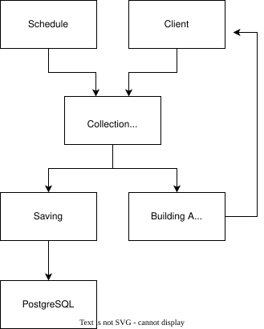

## metric_api Project

This project was developed to learn/understand the fundamentals of backend development. This service, which I developed for my home server, is triggered daily at specified times using a schedule. It collects metrics from the server (or any device), saves them to a database, and also creates a file in JSON format (I made sure the JSON format was readable, simple, and straightforward). In short, this project has taught me a great deal and helped me progress and improve in backend development.

## Endpoints

Base path: '/api/v1/metrics'

- `POST /collect`     → collects metrics and saves to DB.
- `GET /`             → returns all metrics  
- 'GET /log/{id}'     → returns a metric log by id
- 'DELETE /log/{id}   → deletes a metric log by id
- `GET /system`       → returns system info (hostname, OS, uptime)  
- `GET /cpu`          → returns only CPU metrics  
- `GET /memory`       → returns only RAM metrics  
- `GET /disk`         → returns only disk metrics  

## Architecture

## Technology

- Java
- Maven
- Springboot

## Licence
- Apache License 2.0 
